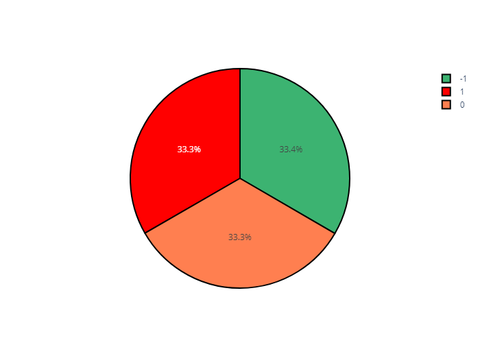
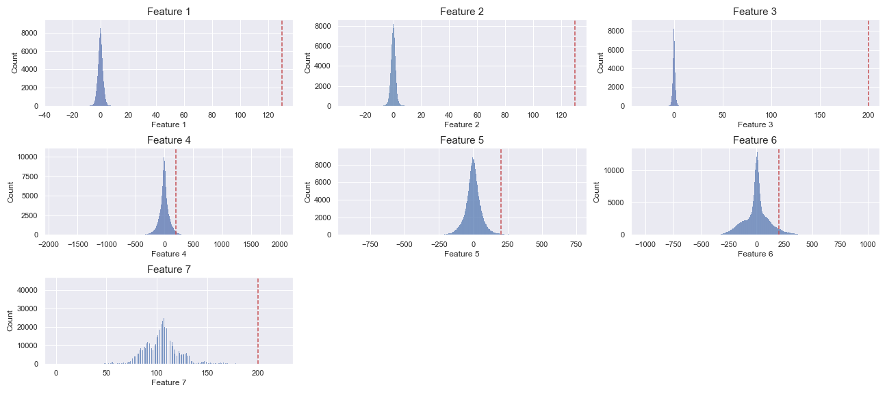

## Dataset:

The dataset consists of 44 samples, where each sample is a multivariate time-series containing: 
-	Data: Data refers to the values of 7 low-level features such as, e.g., heart rate. 
-	Emotion: Emotion refers to the ground truth emotion (encoded as -1, 0 or 1). Note that this emotion varies along time in the same sample. 

## Data Analysis
 
 

- All Emotions have same proportion.
 

- Apparently all features expect feature  7 is quite close to a normal distribution.The average of them are approxmatly to zero. It seems to me that fearture  7 follow a right-skewed distribution (lognormal).

 

- Correlation Matrix: 

Models for training:
------------------------

We used models and their motivation as below:

-  Machine Learning method

Boosting algorithms such as **LightGBM, AdaBoost, Catboost, and XGBoost** are widely used machine learning algorithms. "Boost" comes from a gradient-boosting machine learning algorithm, as this library is based on a gradient-boosting library. Gradient boosting is a robust machine learning algorithm that is widely applied to multiple types of business challenges like fraud detection, recommendation items, and forecasting. It can also return perfect results with relatively less data, unlike DL models that need to learn from the massive amount of data.

The other model is **RandomForestClassifier**. As the dataset is time series, we can sliding windows as preprocessing step, which is essential for converting time-series data into a format suitable for machine learning models that expect fixed-size input. It helps in capturing temporal dependencies and can also act as a form of data augmentation by creating overlapping windows. 

- Recurent Neural network

RNNs are useful for sequential data, and while building the model, they take the order of data into consideration. We can use an RNN such as LSTM or GRU to predict changes in a time series.

Result of Training:
----------------------

|Dataset|Model               |Test Accuracy|
|--     |--                  |--    --     |
|1      |XGBClassifier       |100          |
|2      |AdaBoostClassifier  |100          |
|3      |LightGBM Classifier |100          |
|4      |CatBoost Classifier |100          |
|5      |LSTM                |100          |

### Requirements

    python==3.10.6
    